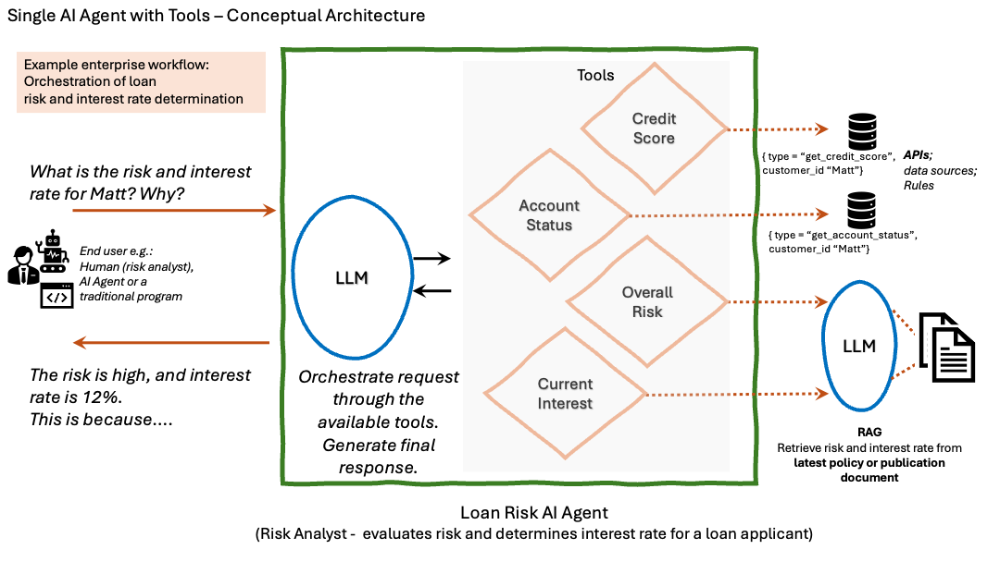
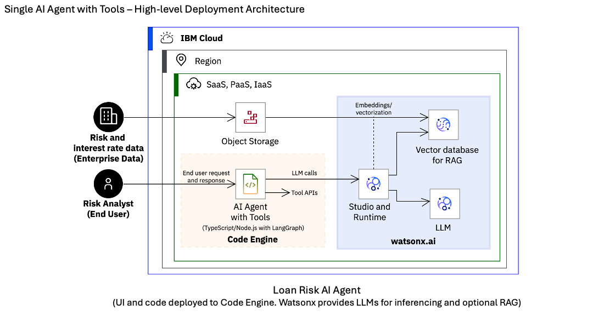
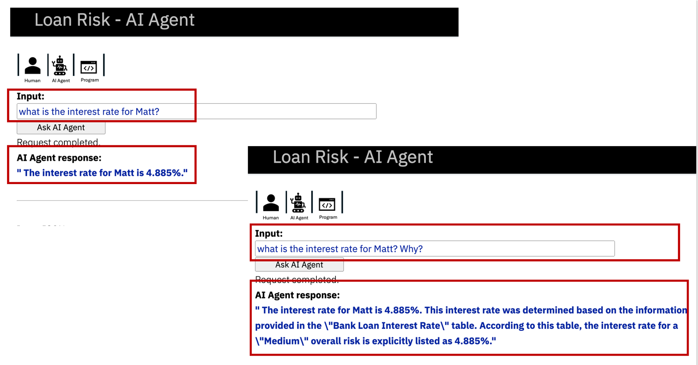

# Loan Risk - AI Agent

This repository provides an AI agent sample application for demonstration and proof-of-concept(PoC) to help agentic AI adoption in industry/enterprise workflows and use cases.

With a focus on the financial industry, it uses a bank loan processing workflow as an example that leverages agentic AI. It demonstrates one of the main values of using agentic AI - _relying on LLMs to reason about what to do and take actions_, instead of relying on traditional approach of rules and conditions. 

The application is built to run on IBM Cloud – deploy on Code Engine to host the code for the AI agent, use watsonx.ai for inferencing and retrieval augmented generation (RAG) with LLMs, and watsonx Assistant for a chat conversation experience.

To learn more about the key features and architectural concepts of agentic AI using the Loan Risk AI Agent refer to the article [Agentic AI in enterprise workflow automation](https://developer.ibm.com/articles/agentic-ai-workflow-automation/).

For questions or feedback contact Anuj Jain (jainanuj@us.ibm.com)

## Use Case
+ AI agent to support bank loan risk evaluation workflow.
+ AI agent determines overall risk and interest rate for a bank loan using LLMs and relevant tools.

Similar use cases can be found in insurance, healthcare and other industry/enterprise workflows.

## Architecture
+ Architecture: Single AI Agent with Tools (using LangGraph, TypeScript/NodeJS)
+ LLM: mistral-large (from IBM watsonx.ai)
+ Tools: API/functions (for credit score, account status, risk evaluation criteria, interest rate determination)

#### Conceptual Architecture

#### High-level Deployment Architecture

## Deployment
#### Prerequisites
Requires IBM Cloud account with:
- watsonx.ai services
- Account user with administrative privileges for watsonx.ai, Code Engine, Container Registry
- Account user’s API key

Optional enhancements:

For using agentic RAG feature, you will also need watsonx.ai vector index and a deployed RAG inferencing endpoint. 

For using chat conversaiton feature, you will need watsonx Assistant/Orchestrate service.

Steps for deploying the base and enhancements are provided below.

#### Steps
- IBM Cloud Code Engine - Refer instructions [here.](artifacts/deployment/deployment-README.md)
- Python Notebook - A simplified version of this PoC can be downloaded from [here](artifacts/python-notebook/NB-ai-agent-loan-risk-demo-v1.ipynb) and imported in watsonx.ai Project as an asset. It is meant for understanding the concepts and for experimentation.

## Usage
For usage and additional examples refer [here.](artifacts/usage-examples/usage-examples-README.md)

  

